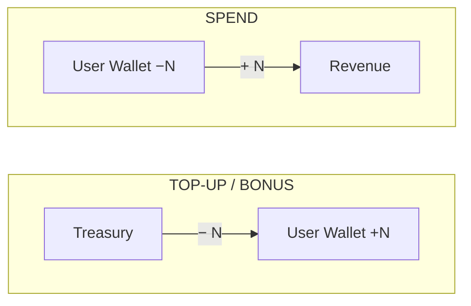

# Internal Wallet Service

**Live API**: https://internal-wallet-service-ibeu.onrender.com

## Try it Now

```bash
BASE=https://internal-wallet-service-ibeu.onrender.com

# 1. Health check
curl $BASE/health

# 2. Alice's current balance (account 3, Gold Coins = asset_type 1)
curl "$BASE/api/v1/accounts/3/balance?asset_type_id=1"

# 3. Top up Alice with 100 Gold Coins  (change the key on retry to get a fresh transaction)
curl -X POST $BASE/api/v1/transactions/topup \
  -H "Content-Type: application/json" \
  -H "Idempotency-Key: topup-alice-001" \
  -d '{"account_id":3,"asset_type_id":1,"amount":100,"description":"Top up via Stripe"}'

# 4. Alice spends 50 Gold Coins
curl -X POST $BASE/api/v1/transactions/spend \
  -H "Content-Type: application/json" \
  -H "Idempotency-Key: spend-alice-001" \
  -d '{"account_id":3,"asset_type_id":1,"amount":50,"description":"Purchase: Avatar Bundle"}'

# 5. Retry spend with same key — returns idempotent:true, no double-debit
curl -X POST $BASE/api/v1/transactions/spend \
  -H "Content-Type: application/json" \
  -H "Idempotency-Key: spend-alice-001" \
  -d '{"account_id":3,"asset_type_id":1,"amount":50,"description":"Purchase: Avatar Bundle"}'
```

> **Note**: Render's free tier spins down after inactivity — the first request may take ~30 s to cold-start.

---

A high-performance, double-entry ledger wallet service built for high-traffic gaming and loyalty platforms. Tracks virtual currency credits (Gold Coins, Diamonds, Loyalty Points) with full auditability, ACID guarantees, and concurrency safety.

## Tech Stack

| Layer | Technology | Why |
|-------|-----------|-----|
| Language | Java 21 | LTS, Project Loom virtual threads for massive concurrency |
| Framework | Spring Boot 3.3 | Production-proven, `@Transactional`, auto-configured HikariCP |
| HTTP | Spring Web MVC | `@RestController`, built-in validation |
| Data Access | JdbcTemplate + NamedParameterJdbcTemplate | Full SQL control for `SELECT FOR UPDATE` and `ON CONFLICT` |
| Connection Pool | HikariCP | Best-in-class JDBC pool, bundled with Spring Boot |
| Database | PostgreSQL 16 | ACID, row-level locking, `FOR UPDATE`, `ON CONFLICT` |
| Container | Docker + docker-compose | Single-command spin-up |

**Why Java + Spring Boot?**
Spring Boot is the industry standard for enterprise Java. `@Transactional` provides declarative transaction management. JdbcTemplate gives full SQL control without ORM magic — critical for a wallet service where every SQL statement must be precise. Java 21 virtual threads (via `spring.threads.virtual.enabled=true`) allow the service to handle thousands of concurrent wallet requests with near-zero per-thread overhead.

**Why PostgreSQL?**
PostgreSQL has the strongest ACID guarantees among open-source relational databases. Its `SELECT ... FOR UPDATE` row-level locking, `ON CONFLICT DO NOTHING` for idempotent inserts, and reliable transaction isolation make it the ideal choice for a financial ledger system.

---

## Quick Start (Docker — Recommended)

```bash
# Clone / unzip the project, then:
docker-compose up --build
```

That's it. Docker will:
1. Start PostgreSQL 16
2. Run `migrations/001_init.sql` (schema)
3. Run `scripts/seed.sql` (seed data)
4. Build and start the Spring Boot service

The API is available at **http://localhost:8080**

---

## Local Development (without Docker)

### Prerequisites
- Java 21+
- Maven 3.9+
- PostgreSQL 16 running locally

### Setup

```bash
# 1. Create the database
psql -U postgres -c "CREATE USER wallet WITH PASSWORD 'wallet_secret';"
psql -U postgres -c "CREATE DATABASE wallet_db OWNER wallet;"

# 2. Run the schema migration
psql -U wallet -d wallet_db -f migrations/001_init.sql

# 3. Run the seed data
psql -U wallet -d wallet_db -f scripts/seed.sql

# 4. Copy environment config
cp .env.example .env
# Edit .env if your DB credentials differ

# 5. Run the service
export SPRING_DATASOURCE_URL=jdbc:postgresql://localhost:5432/wallet_db
export SPRING_DATASOURCE_USERNAME=wallet
export SPRING_DATASOURCE_PASSWORD=wallet_secret
mvn spring-boot:run
```

The API is available at **http://localhost:8080**

---

## Seeded Data

The seed script initializes the database with the following accounts and balances:

| Account  | Type   | Asset     | Balance |
|----------|--------|-----------|---------|
| Treasury | system | Gold Coins | (source — can go negative) |
| Revenue  | system | Gold Coins | 0 (spend sink) |
| Alice    | user   | Gold Coins | 500 |
| Bob      | user   | Gold Coins | 200 |

**Asset Types**: Gold Coins (GOLD), Diamonds (DIAM), Loyalty Points (LPTS)

**Account IDs** (after seeding):
- `1` = Treasury
- `2` = Revenue
- `3` = Alice
- `4` = Bob

**Asset Type IDs**:
- `1` = Gold Coins
- `2` = Diamonds
- `3` = Loyalty Points

---

## API Reference

All endpoints return JSON. Error responses have the shape `{"error": "message"}`.

### Health

```
GET /health
```
```json
{ "status": "ok" }
```

---

### Asset Types

```
GET /api/v1/asset-types
```
```json
[
  { "id": 1, "name": "Gold Coins", "code": "GOLD", "decimals": 0, "created_at": "..." },
  { "id": 2, "name": "Diamonds",   "code": "DIAM", "decimals": 0, "created_at": "..." },
  { "id": 3, "name": "Loyalty Points", "code": "LPTS", "decimals": 0, "created_at": "..." }
]
```

---

### Accounts

```
GET /api/v1/accounts
```
```json
[
  { "id": 1, "type": "system", "name": "Treasury", "created_at": "..." },
  { "id": 2, "type": "system", "name": "Revenue",  "created_at": "..." },
  { "id": 3, "type": "user",   "name": "Alice",    "created_at": "..." },
  { "id": 4, "type": "user",   "name": "Bob",      "created_at": "..." }
]
```

```
POST /api/v1/accounts
Content-Type: application/json

{ "type": "user", "name": "Charlie" }
```
Returns `201 Created` with the new account.

---

### Balance

```
GET /api/v1/accounts/{id}/balance?asset_type_id={id}
```
```json
{ "account_id": 3, "asset_type_id": 1, "balance": 500 }
```

Balance is always **computed live** as `SUM(ledger_entries.amount)` — never read from a cached column.

---

### Ledger (Audit Trail)

```
GET /api/v1/accounts/{id}/ledger?asset_type_id={id}&page=1&page_size=20
```
```json
{
  "entries": [
    {
      "id": 3,
      "transaction_id": 2,
      "transaction_type": "topup",
      "transaction_description": "Initial seed balance for Alice",
      "wallet_id": 5,
      "amount": 500,
      "created_at": "..."
    }
  ],
  "total": 1,
  "page": 1,
  "page_size": 20
}
```

- Entries are ordered newest-first
- `amount` is positive (credit) or negative (debit)
- Maximum `page_size` is 100

---

### Transactions

All three endpoints require the `Idempotency-Key` header. Use a unique UUID per request. Retrying with the same key returns the original result (`"idempotent": true`, HTTP 200) without reprocessing.

#### Wallet Top-up (Purchase)

Credits a user's wallet after a successful payment.

```
POST /api/v1/transactions/topup
Idempotency-Key: <unique-uuid>
Content-Type: application/json

{
  "account_id": 3,
  "asset_type_id": 1,
  "amount": 100,
  "description": "Top-up via Stripe payment intent pi_abc123"
}
```

Response `201 Created`:
```json
{
  "transaction": {
    "id": 3,
    "idempotency_key": "your-uuid",
    "type": "topup",
    "description": "Top-up via Stripe payment intent pi_abc123",
    "status": "completed",
    "created_at": "..."
  },
  "ledger_entries": [
    { "id": 5, "transaction_id": 3, "wallet_id": 1, "amount": -100, "created_at": "..." },
    { "id": 6, "transaction_id": 3, "wallet_id": 5, "amount":  100, "created_at": "..." }
  ],
  "idempotent": false
}
```

#### Bonus / Incentive

Issues free credits (referral bonus, welcome reward, etc.).

```
POST /api/v1/transactions/bonus
Idempotency-Key: <unique-uuid>
Content-Type: application/json

{
  "account_id": 3,
  "asset_type_id": 1,
  "amount": 50,
  "description": "Welcome bonus — new user registration"
}
```

Response `201 Created` (same shape as topup, `type: "bonus"`).

#### Purchase / Spend

Deducts credits when a user buys an in-app item or service.

```
POST /api/v1/transactions/spend
Idempotency-Key: <unique-uuid>
Content-Type: application/json

{
  "account_id": 3,
  "asset_type_id": 1,
  "amount": 200,
  "description": "Purchase: Premium Avatar Bundle"
}
```

Response `201 Created`:
```json
{
  "transaction": { "id": 4, "type": "spend", ... },
  "ledger_entries": [
    { "wallet_id": 5, "amount": -200, ... },
    { "wallet_id": 2, "amount":  200, ... }
  ],
  "idempotent": false
}
```

Response `422 Unprocessable Entity` (insufficient funds):
```json
{ "error": "Insufficient funds for account 3 (asset_type 1): available=100, requested=200" }
```

---

## Architecture

### Double-Entry Ledger

Every financial movement creates **two ledger entries that sum to zero**:



| Flow | Debit | Credit |
|------|-------|--------|
| Top-up / Bonus | Treasury −N | User +N |
| Spend | User −N | Revenue +N |

**Balance = `SUM(ledger_entries.amount) WHERE wallet_id = ?`**

There is no stored `balance` column. This eliminates balance drift bugs — the balance is always derived from the immutable audit trail of double-entry records.

### Concurrency — How Race Conditions Are Prevented

The spend flow demonstrates the full concurrency-safe pattern:

1. Begin PostgreSQL transaction (`@Transactional`)
2. **Idempotency gate**: `INSERT INTO transactions ... ON CONFLICT DO NOTHING`
3. Get or create wallet rows for both parties
4. **Acquire row locks**: `SELECT ... FOR UPDATE ORDER BY id ASC`
5. Compute user balance inside the lock (serialized read)
6. If balance < amount → throw exception (triggers rollback)
7. Insert paired ledger entries
8. Commit

Because the `FOR UPDATE` lock is held from step 4 to step 8, no concurrent transaction can insert ledger entries for the locked wallets between steps 5 and 7. This makes the balance check at step 5 a true snapshot of the account's state — no other write can race against it.

### Deadlock Avoidance — Ascending Lock Order

Deadlocks occur when two transactions lock the same resources in opposite orders, creating a circular wait. This service prevents deadlocks by **always sorting wallet IDs in ascending order before locking**:

```java
List<Long> sortedIds = Stream.of(walletA.getId(), walletB.getId())
        .sorted()
        .toList();
walletRepo.lockForUpdate(sortedIds);
```

```sql
SELECT id FROM wallets WHERE id IN (:ids) ORDER BY id ASC FOR UPDATE
```

**Why this works**: If Tx1 needs wallets {3, 7} and Tx2 needs wallets {7, 3}, both will attempt to lock wallet `3` first. One of them will block at wallet `3` until the other commits. There is no circular wait — no deadlock can form.

### Idempotency

Clients provide a unique `Idempotency-Key` header (a UUID). The service:

1. Attempts `INSERT INTO transactions (idempotency_key, ...) ... ON CONFLICT DO NOTHING`
2. If `rows affected = 0`, the key was already processed → returns the cached result with `"idempotent": true`
3. If `rows affected = 1`, this is a new request → proceeds with the full business logic

Concurrent duplicate requests: PostgreSQL serializes conflicting `INSERT ON CONFLICT` for the same key. Exactly one request will get `rows = 1`; all others get `rows = 0` and return the cached result. No double-processing is possible.

### Amount Encoding

All `amount` values in API requests and ledger responses are **integer counts of the smallest indivisible unit** of the asset — analogous to satoshis for Bitcoin or cents for USD.

The `decimals` field on an `asset_type` is **display metadata**: a client UI should show `amount / 10^decimals` as the human-readable value.

| `decimals` | Raw `amount` | Displayed as |
|-----------|-------------|-------------|
| 0 | 500 | 500 |
| 2 | 1500 | 15.00 |

All asset types seeded in this deployment use `decimals = 0`, so raw amounts equal displayed values and no conversion is required.

---

## Environment Variables

| Variable | Required | Default | Description |
|----------|----------|---------|-------------|
| `SPRING_DATASOURCE_URL` | Yes | — | JDBC URL, e.g. `jdbc:postgresql://localhost:5432/wallet_db` |
| `SPRING_DATASOURCE_USERNAME` | No | — | PostgreSQL username |
| `SPRING_DATASOURCE_PASSWORD` | No | — | PostgreSQL password |
| `SERVER_PORT` | No | `8080` | HTTP port to listen on |

---

## Project Structure

```
├── src/main/java/com/dinoventures/wallet/
│   ├── WalletApplication.java          # Spring Boot entry point
│   ├── config/JdbcConfig.java          # NamedParameterJdbcTemplate, TransactionManager
│   ├── controller/
│   │   ├── AccountController.java      # Accounts, balances, ledger, asset types, health
│   │   └── TransactionController.java  # Topup, bonus, spend endpoints
│   ├── exception/
│   │   ├── InsufficientFundsException.java
│   │   ├── AccountNotFoundException.java
│   │   ├── AssetTypeNotFoundException.java
│   │   └── GlobalExceptionHandler.java  # @RestControllerAdvice
│   ├── model/                           # Domain entities + DTOs
│   ├── repository/
│   │   ├── AssetTypeRepository.java
│   │   ├── AccountRepository.java
│   │   ├── WalletRepository.java        # getOrCreate() + lockForUpdate()
│   │   ├── TransactionRepository.java   # insertIfNew() (idempotency gate)
│   │   └── LedgerRepository.java        # insert(), getBalance(), getLedger()
│   └── service/WalletService.java       # Core business logic + @Transactional flows
├── migrations/001_init.sql              # Database schema
├── scripts/seed.sql                     # Seed data
├── Dockerfile                           # Multi-stage Java build
├── docker-compose.yml                   # Postgres + App orchestration
└── README.md
```
